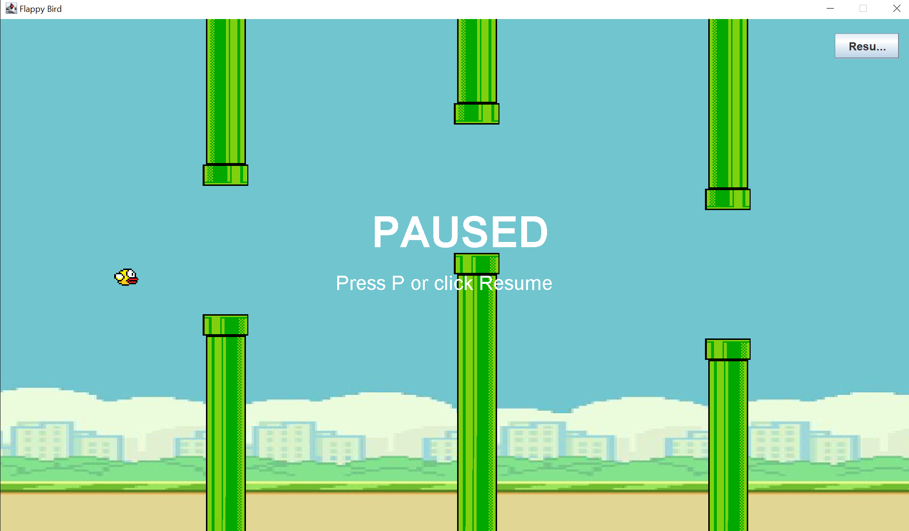
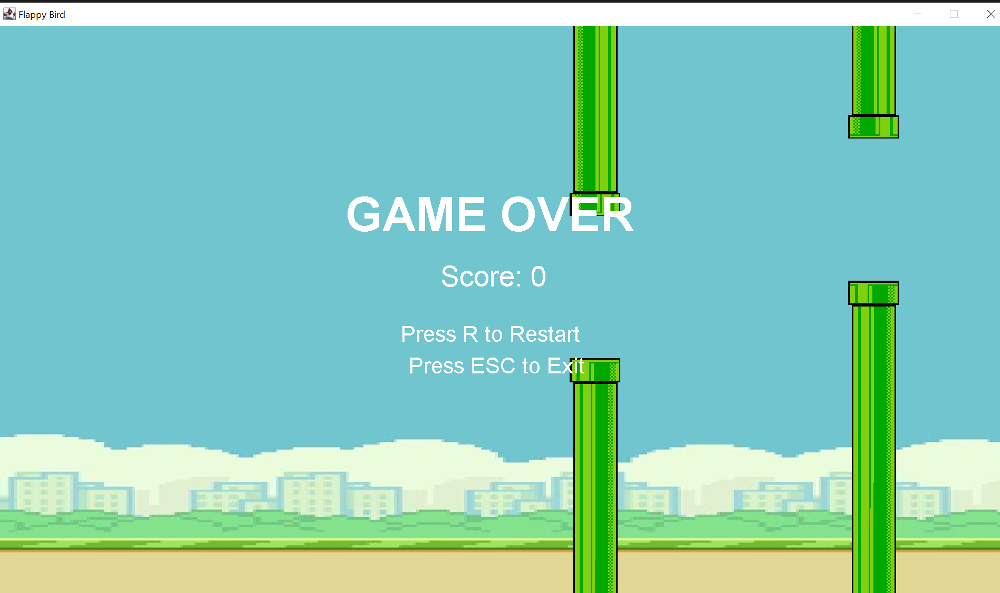

# 🐦 Flappy Bird — Java Edition

A classic **Flappy Bird** clone built from scratch in **Java** using **Swing** for rendering and input handling. Guide the bird through an endless stream of pipes, rack up your score, and try to beat your best run!


---

## 📋 Table of Contents

- [Features](#-features)
- [Demo](#-demo)
- [Getting Started](#-getting-started)
  - [Prerequisites](#prerequisites)
  - [Project Structure](#project-structure)
  - [Installation & Running](#installation--running)
- [Controls](#-controls)
- [How It Works](#-how-it-works)
- [License](#-license)

---

## ✨ Features

- 🎮 Smooth, physics-based bird movement (gravity + velocity)
- 🟩 Procedurally spawned pipes with randomized gaps
- 🏆 Live score tracking as you pass through pipes
- ⏸️ **Pause / Resume** — both via keyboard (`P`) and an on-screen **Pause button**
- 💀 Game-over detection with collision and boundary checks
- 🔁 Instant restart without relaunching the app
- 🖥️ Auto-scales to your screen resolution

---

## 🎥 Game Screenshots



---

## 🚀 Getting Started

### Prerequisites

- **JDK 8 or higher** installed and configured on your system
- A Java IDE (recommended: **VS Code** with the Java Extension Pack, or **IntelliJ IDEA / Eclipse**)

Check your Java version:

```bash
java -version
```

### Project Structure

```
FlappyBirdGame/
├── src/
│   ├── App.java              # Entry point — sets up the game window
│   ├── FlappyBird.java       # Core game logic, rendering, and controls
│   ├── flappybird.png        # Bird sprite
│   ├── flappybirdbg.png      # Background image
│   ├── toppipe.png           # Top pipe sprite
│   └── bottompipe.png        # Bottom pipe sprite
├── bin/                      # Compiled .class files
├── lib/                      # External libraries (if any)
└── README.md
```

### Installation & Running

1. **Clone the repository**

   ```bash
   git clone https://github.com/huzaifa-kureshi/flappy-bird-java.git
   cd flappy-bird-java
   ```

2. **Compile the source files**

   ```bash
   cd src
   javac *.java
   ```

3. **Run the game**

   ```bash
   java App
   ```

   > 💡 Make sure the image assets (`flappybird.png`, `flappybirdbg.png`, `toppipe.png`, `bottompipe.png`) remain in the same folder as the compiled classes, since they're loaded via relative resource paths.

**Or, using an IDE:** open the project folder, and run `App.java` directly.

---

## 🕹️ Controls

| Key / Action        | Effect                          |
|----------------------|----------------------------------|
| `SPACE`              | Flap / jump                     |
| `↑` Arrow            | Nudge bird up                   |
| `↓` Arrow            | Nudge bird down                 |
| `P`                  | Pause / Resume the game         |
| **Pause button**     | Click to Pause / Resume         |
| `R`                  | Restart after Game Over         |
| `ESC`                | Exit the game                   |

---

## ⚙️ How It Works

- **Game Loop:** A Swing `Timer` ticks at ~60 FPS, updating bird position, pipe positions, and repainting the screen each frame.
- **Physics:** Gravity constantly increases the bird's downward velocity; pressing `SPACE` applies an upward impulse.
- **Pipe Spawning:** A separate `Timer` spawns a new pair of pipes (top and bottom) at a randomized vertical offset every 1.5 seconds.
- **Collision Detection:** Simple axis-aligned bounding box (AABB) checks determine when the bird hits a pipe or goes out of bounds.
- **Pause System:** A boolean `paused` flag freezes the game loop and pipe spawning. It can be toggled either by pressing `P` or clicking the on-screen **Pause** button, which also updates its label to **Resume**.

---

## 📄 License

This project is licensed under the **MIT License** — feel free to use, modify, and distribute it. See the [LICENSE](LICENSE) file for details.

---

<p align="center">Made with ☕ and Java Swing</p>

